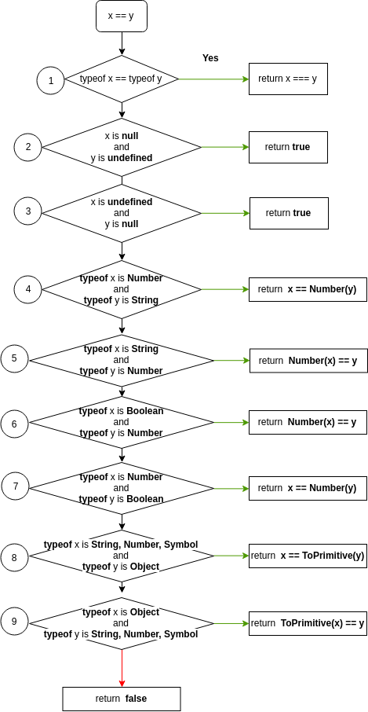

## Loose equality / Double equals operator (==)

Although it would seem like using the loose equality operator **==** is good enough, it might cause some unexpected errors due to funky implicit coercion that takes place whenever the types of the values involved doesn't match.

Just to evaluate a simple **x == y** statement, JavaScript follows the below flow chart.



source: <a href="http://www.ecma-international.org/ecma-262/#sec-abstract-equality-comparison" target="_blank" rel="nofollow noopener" title="equality comparison"> ECMAStandard abstract equality comparison</a>

To understand the complete flowchart for the equality operator, you have to understand how **Number** function and the abstract **ToPrimitive** works as well. Let's see them one by one with examples.

### ToNumber in context of "=="

| Value          | Becomes…                                                                                                                                                                |
| -------------- | ----------------------------------------------------------------------------------------------------------------------------------------------------------------------- |
| true and false | 1 and 0                                                                                                                                                                 |
| string         | Whitespaces from the start and end are removed. If the remaining string is empty, the result is 0. Otherwise, the number is “read” from the string. An error gives NaN. |

source : source: <a href="http://www.ecma-international.org/ecma-262/#sec-tonumber" target="_blank" rel="nofollow noopener" title="ToNumber"> ECMAStandard ToNumber</a>

- one of weirdest rule in loose equality coercion is when boolean and numbers are involved. Instead of converting number to Boolean, Booleans are converted to Numbers.
- when a boolean and number are used in "==" operator, the only times when they can become _true_ are these

```javascript
true == 1; // true
1 == true; // true
false == 0; // true
0 == false; // true
```

- Any other variation of number and boolean would always end up as _false_

```javascript
true == 200; // false
1000 == true; //false
true == 123; // false
false == 1; // false
1309 == false; // false
```

- As for strings and number, they work as expected.

### ToPrimitive in context of "=="

- The simplest case for object coercion to primitive values is converting to **Boolean**. It always coerces to **true** whether it is an array or an Object.
- For coercing an Object to String or a Number, Object.prototype includes two functions called **toString** and **valueOf** . Since it is on the top of protypal inheritance chaing, it will be available to all objects by default.
- To convert an Object, lets say _input_ to a primitive type, these functions _input.toString()_ and _input.valueOf()_ are called in sequence. If any of that function returns a primitive value, then it is returned otherwise it throws error.
- For _String_ conversion _toString_ is called first.
- For _Number_ conversion _valueOf_ is called first.
- In the context of **"=="** operator, no preferred type is assume so by default, **valueOf** is called first, followed by **toString**.
- Any one can override these two methods and change the default behavior.

```javascript
// to check valueOf is called first
123 == { valueOf: () => 123, toString: () => "I'm a string" }; // true
123 == { valueOf: () => [1, 2, 3], toString: () => 123 }; // true
```

- manipulating these functions, you can arrive at some strange statements. For example this question.
  > Can _(a==1 && a==2 && a==3)_ ever evaluate to true?
  > Answer — Yes.

```javascript
const a = {
  val: 0,
  valueOf: function() {
    return (this.val += 1);
  }
};
console.log(a == 1 && a == 2 && a == 3); // true
```

- Although something like this is possible, in a production level codebase one would never come across code like this.

## Boolean Context vs Equality

- People often confuse "==" with Boolean context. For example,

```javascript
const a = 100;
if (a) {
  console.log("I passed");
}
//I passed

console.log(100 == true); //false
```

- This is because coercion is different form Boolean contexts.
- Boolean contexts are places where a Boolean value is expected. In such cases if the expected value is not Boolean, then it is directly converted to Boolean.
- Some examples of Boolean contexts are

```javascript
if (myTruthyOrFalsyValue) {
}

while (myTruthyOrFalsyValue) {}

for (; myTruthyOrFalsyValue; ) {}
```

- In these places there are no operators involved. So special coercion rules involving operators instead they value is converted to Boolean implicitly.
- This is why truthy and falsy values can be used in those places.

## Strict Equality / Triple Equal Operator (===)

- Tiple Equal **===** checks for both the **type** and the **value** instead of doing any coercion.
- It is straight forward and how the equality should have worked in the first place.

```javascript
15 === 15; // true
"hello world" === "hello world"; // true
true === true; // true

true === 1; //false
0 === false; // false
100 === "100"; //false
123 === { valueOf: () => 123, toString: () => "I'm a string" }; //false
```

- Since it is not easy to remember all the rules for loose equality all the time it is better to use "===" always.
- To imagine, just how difficult it is remember double equality conditions just see this <a href="https://dorey.github.io/JavaScript-Equality-Table/" target="_blank" rel="nofollow noopener" title="equality comparison">chart</a>

## Moral of the story

> Just stick with "==="
