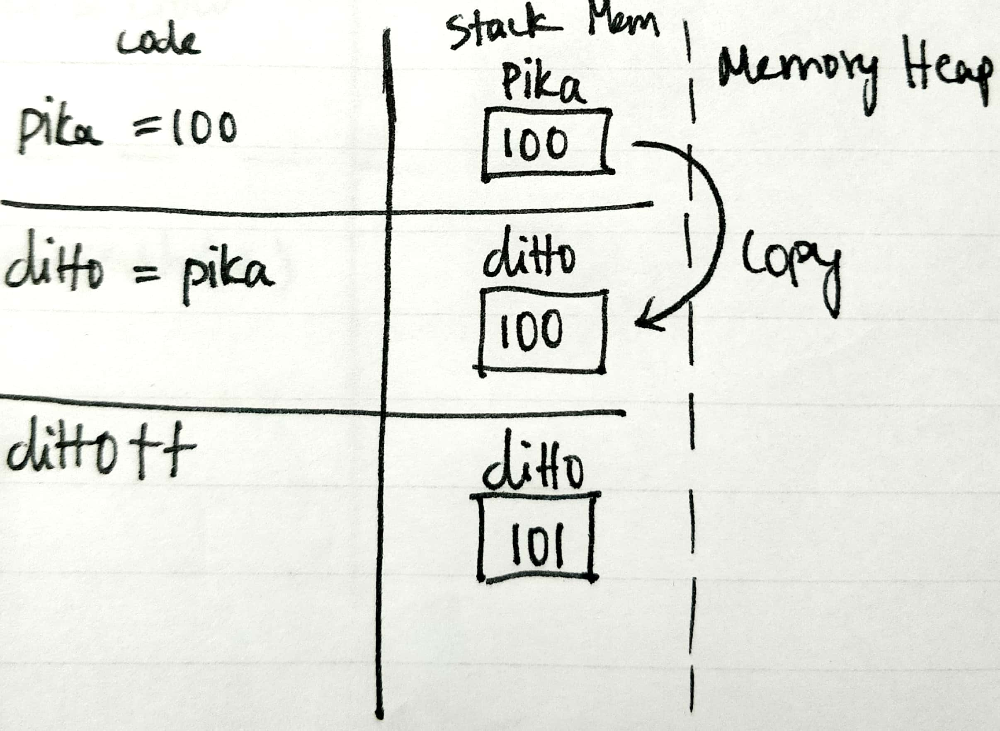
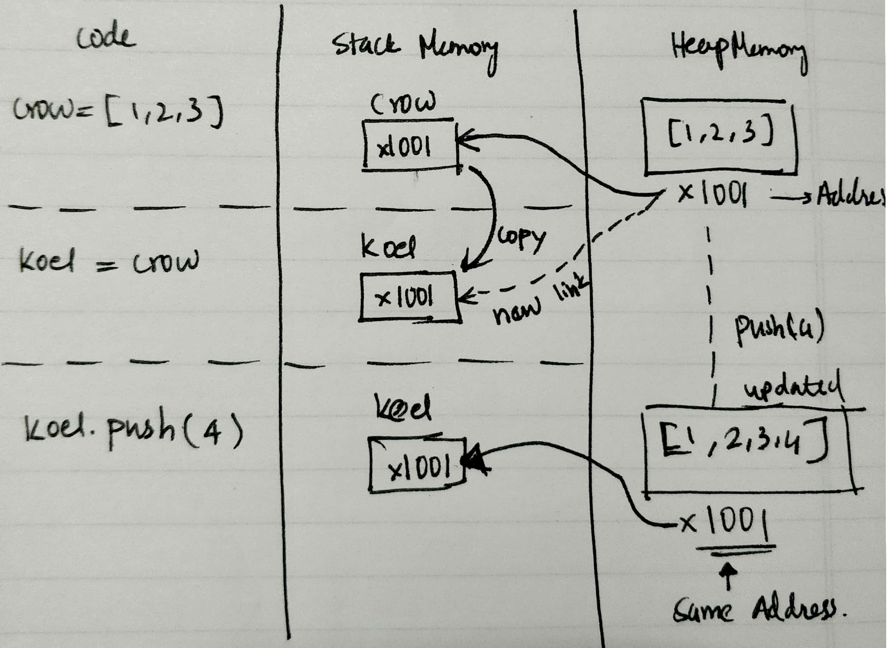
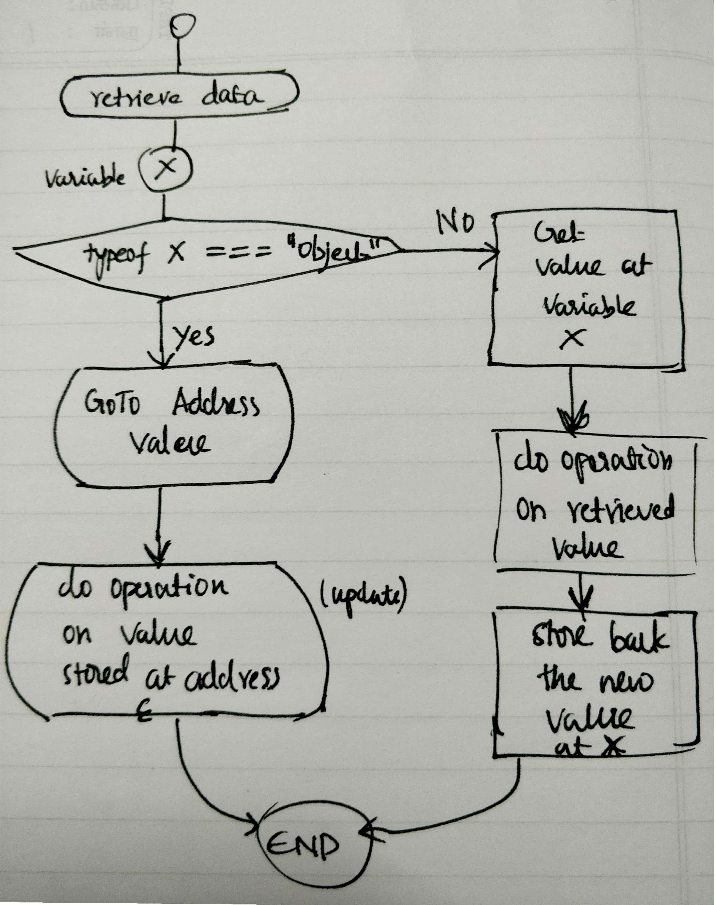

To understanding how passing around arguments into functions work in javascript, we should first understand the types of data and how they are stored in javascript.

## Data Types in JavaScript

Javascript is an **untyped** language (i.e) no typed declaration for variable. This means that a variable can store any type of data. This is often misunderstood as no data type in javascript.

With the latest ECMAScript standard there are seven data types in javascript.

1. Six data types that are primitives:
   1. Boolean
   2. Null
   3. Undefined
   4. Number
   5. String
   6. Symbol (new in ECMAScript 6)
2. Object (or) non primitive (or) compound

## How different data types are stored ?

In context of pass by value and pass by reference, we should be looking only at the two broad categories, **primitive data types** and **non primitive data types**

### Primitive Values (_assign by value_)



- Primitive Values are always _immutable_.
- Primitive values are always assigned by value (i.e) copied

```javascript
let pika = 100;
let ditto = pika; //assign by value (copied)
ditto++;
console.log(pika); //100
console.log(ditto); //101
```

Changing ditto doesn't affect pika at all. when pika was assigned to ditto, ditto made a copy of pika. It's a copy.

### Compound Values (_assign by reference_)



- Compound Values are mutable by default. (unless it is frozen)
- Compound Values are always assigned by reference

```javascript
let crow = [1, 2, 3];
let koel = crow; //assign by reference
koel.push(4); //4 is added to crow
console.log(crow); //[1, 2, 3, 4]
console.log(koel); //[1, 2, 3, 4]
```

Here crow and koel are one and same. So mutating koel affects the original variable crow, as koel is just pretending to be crow. It's an alias.

```javascript
koel = [1, 2, 3]; //this creates a new object
koel.push(100); //adds 100 to the newly created object and doesn't affect crow
```

From this point onwards koel is a completely new entity and goes separate ways from crow.

### Pass By Value

```javascript
function passByValue(ditto) {
  ditto++;
}
let pika = 100;
console.log(pika); // 100
passByValue(pika); // pika is copied to ditto i.e passed by value
console.log(pika); // 100
```

### Pass By Reference

```javascript
function passByReference(koel) {
  kole.push(100);
}
let crow = [1, 2, 3];
passByReference(crow); //crow's reference is copied into koel
console.log(crow); //[1, 2, 3, 100]
```

## An Aside



Now that we have understood pass by value and pass by reference. Let's dive a little deeper. If we look at how actually the data is stored in a variable, we can say that javascript is always copying the values. It is just the retrieval process that makes the difference.

In case of Object, the value stored in the variable is the address of object. so all operations are done after retrieving the object and the value is updated to the object itself.

In case of primitive data, the actual value itself is stored in the variable. Since the primitive data are immutable, any operation on it creates a new value and the old value in the variable is replaced.

```javascript
let x = "my string";
x += "is awesome"; // creates a new string "my string is awesome" and old value is replaced
```

It can be seen as if only read and write(replace) operation are permitted in case of primitive data. There is no update.
