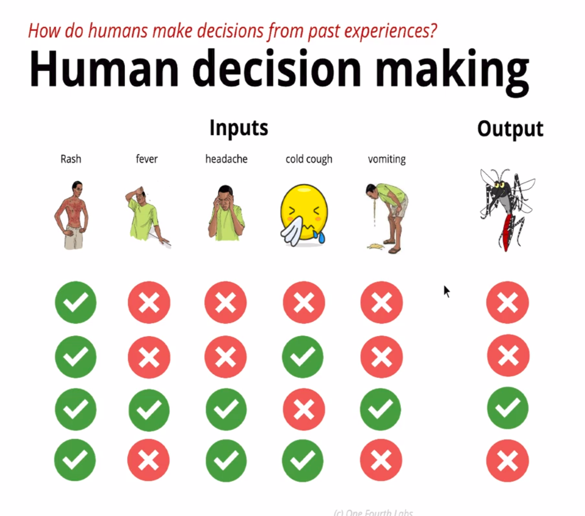
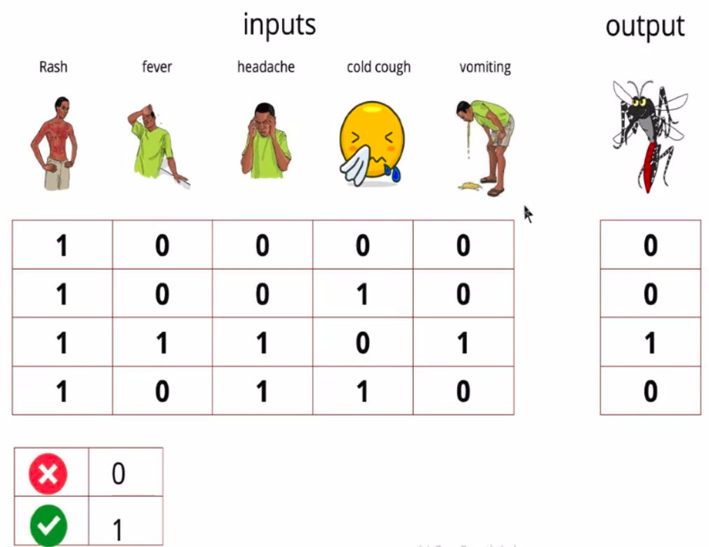
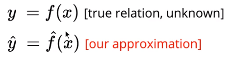
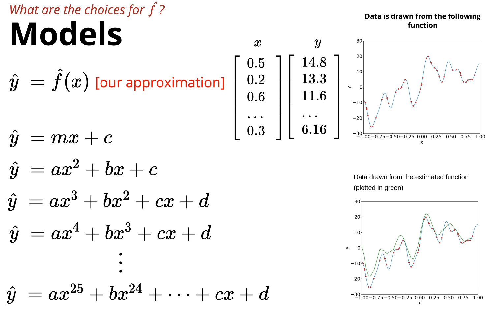
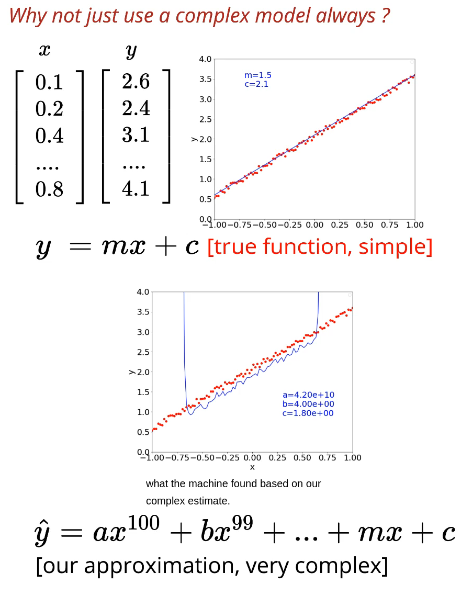
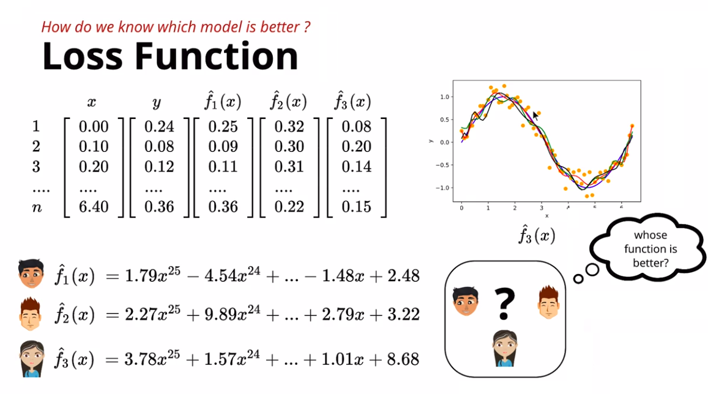
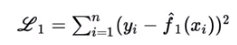
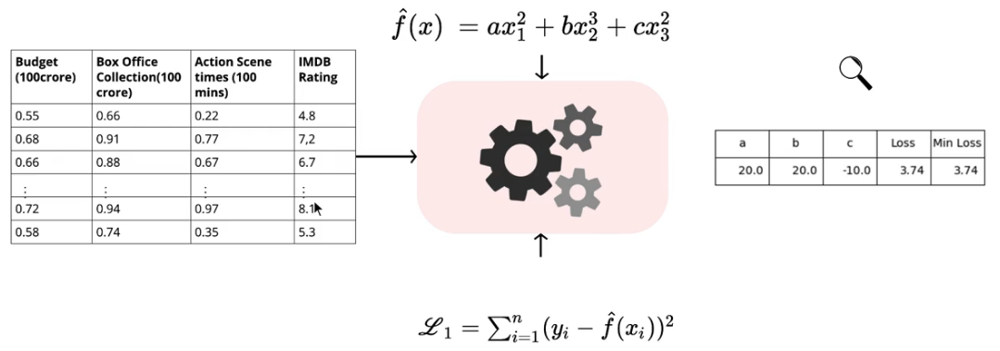
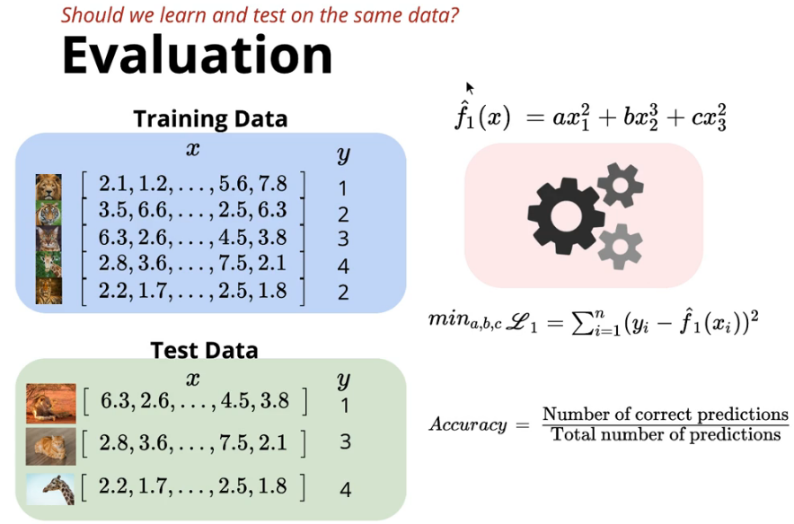

Whenever I try to get started with Machine Learning, it was like a myth. The concept of six jars introduced by <a title="One fourth Labs" href="https://padhai.onefourthlabs.in/" target="_blank" rel="nofollow noopener">One Fourth Labs</a> made it very simple.

*Disclaimer :* The contents and topics discussed in this post are based on the Deep Learning course offered by <a title="One fourth Labs" href="https://padhai.onefourthlabs.in/" target="_blank" rel="nofollow noopener">One Fourth Labs</a>

## Expert Systems

Expert system is how we humans used to solve problems. We coded all the logics and rules to solve a problem and the only part machines played were to execute the code and give the result.

### How humans make decisions ?

Before going into explanation of Expert Systems, consider a scenario where a doctor is checking patients for dengue.

The doctor checks for various symptoms and their results. Based on the doctor's knowledge and experience, the doctor comes to a decision on whether the patient has the disease or not. As the doctor examines more and more patients, his knowledge also grows improving his decisions better.

_Credits :_ <a title="One fourth Labs" href="https://padhai.onefourthlabs.in/" target="_blank" rel="nofollow noopener">_One Fourth Labs_</a>

If a programmer were to develop a software by getting all the data in the doctor's head and translate the data as rules to be evaluated based on the given input (i.e symptoms and their result), couldn't the same diagnosis the doctor arrived at, be done by any normal person. Such systems are called _expert system_.

_translating to numeric data_, _Credits :_ <a title="One fourth Labs" href="https://padhai.onefourthlabs.in/" target="_blank" rel="nofollow noopener">_One Fourth Labs_</a>

Typically an expert system consists of a rule engine which process rules, a knowledge base of rules, a database of facts, a natural language interface that interacts with the knowledge experts and users. A user can use the UI to interact with the system to get recommendations/ decisions based on the input supplied. The knowledge expert can use the system to update/modify the knowledge base of rules and facts.

### How machine learning came into picture ?

Based on what we know about expert systems, it seems as if we can solve any decision making problems as long as we find all the rules involved. The example given above was a simplified version of the actual problem (real diagnosis expert systems may involve 1000s of rules, may be even more), so we were able to solve it by actually figuring out all the rules.

Now lets take complex problem where hundreds of input data (like the symptoms we saw earlier) are involved. There it becomes difficult to formulate all the rules. It becomes harder and harder to solve the problem with expert system as the input data points grows beyond a limit.

What if we can come up with a way, where the system will take all these large inputs and give me a function that will get me the output close to the correct one. This is what machine learning solves.

This course has taken an approach to explain how machine learning works in practice by dividing it into six jars. However, I call it the building blocks of practicing machine learning. Each block sheds light on to machine learning myth a little bit.

## Block 1 : Data

We live in the age of Data. With data democratization, it's very easy to get our hands on them. But to solve any problem with machine learning the primary requirement for the data is, it must be in machine readable format.

> For data to be usable, it must be in machine readable format.

### Different data formats

1. Structured Data
2. Text Data
3. Image Data
4. Video Data
5. Audio Data

Each type of data is handled differently (i.e) converted to machine readable data through different techniques in practice. For example text can be represented as numerical data by using techniques involving some type of vectorization usually (will be discussed later posts). Image Data can be encoded to multi dimensional pixel values which are numeric data. Video can be converted to frames and each frame can be represented as Image. Audio can be converted to numeric data based on frequency. So each type of data can be processed and curated before applying machine learning techniques.

### Data and Machine Learning

Even though machine learning can solve problems with just the curated input, it works only for certain types of problems such as clustering, generation etc. This is called _un-supervised learning_. There haven't been much industry success with this kind.

About 90% of machine learning tasks in the field are actually of the other type, where we supply curated data of the format

1. X => The input data
2. Y => The expected output data for the supplied input.

This X and Y must be supplied in large quantities. Eventually the machine will be able to give output for new input based on the relationship it has found out. This type is called _supervised learning_.

### How to get data?

#### Free Data

- <a title="Wiki Data" href="https://www.wikidata.org/wiki/Wikidata:Main_Page" target="_blank" rel="nofollow noopener">_Wiki Data_</a>
- <a title="indian gov data" href="https://data.gov.in/" target="_blank" rel="nofollow noopener">_indian gov data_</a>
- <a title="Google AI datasets" href="https://ai.google/tools/datasets/" target="_blank" rel="nofollow noopener">_Google AI datasets_</a>
- <a title="UCI Machine Learning dataset repo" href="https://archive.ics.uci.edu/ml/datasets.html" target="_blank" rel="nofollow noopener">_UCI Machine Learning dataset repo_</a>

There are way too many free data sets available. Just do a google search for free datasets for machine learning.

#### Crowd Sourcing (Buy Data with Money)

There are many service where you can give your input data and ask people to label the output by paying money, so you can get the initial X, Y data required for supervised learning. Here are few services,

- <a title="Amazon Mechanical Turk" href="https://www.mturk.com/" target="_blank" rel="nofollow noopener">_Amazon Mechanical Turk_</a>
- <a title="Data Turk" href="https://dataturks.com/" target="_blank" rel="nofollow noopener">_Data Turk_</a>
- <a title="Figure 8" href="https://www.figure-eight.com/" target="_blank" rel="nofollow noopener">_Figure 8_</a>

There are many more again. You can search for it like buy datasets.

#### Generate/ Simulate Data

Using some techniques you can simulate your own data which composes the X (input) and Y (output) part.

For example it is easy to generate data for sign boards like this.

- Empty yellow background image + Hindi Text => X
- Definition of the Hindi Text from Dictionary => Y

Using this technique we could generate as many (X, Y) set as possible.

## Block 2 : Tasks

Once we get data, we must identify what to do with the data (i.e) find a problem that can be solved with the data.

### What kind of tasks?

1. Un-Supervised Tasks

   - clustering
     - group similar data
   - anamoly / fraud detection
   - generation of new data
     - generate something like a trump tweet

2. Supervised Tasks
   - classification
   - regression
   - prediction

### Some examples of tasks

- guess what a user will buy next based on user's past buying pattern and recommending them. (any recommendations)
- identifying faces in facebook pics.
- identifying location of pic.
- movie score prediction based on review data.

## Block 3 : Models

_Credits :_ <a title="One fourth Labs" href="https://padhai.onefourthlabs.in/" target="_blank" rel="nofollow noopener">_One Fourth Labs_</a>

Say we have curated our data and also found out what problem to solve. We can give to the machine and get the output right ? Well, it's not so simple.

Earlier we saw that the machine will help you find the relation (function) if we supply a large quantiy of data of format X (input) and Y (output). How does it magically guess the answer?

Before the machine could start guessing the relation, it needs to start somewhere right? That's where we humans pitch in. We give a rough estimate function saying I guess this might be the one. This estimate relation between input, x, and output, y, which closely resembles the true relation can be defined as a _model_

### Example

Say I have got one-dimensional points of (x, y) and plotted this data on to a graph, it gives a graph. I want to find the function (an equation) which will give generate such a graph.

_Attempt 1 :_ Since I need to start out with an esitimate function, I give _y= mx + c_. Assume the machine gives _y = 0.842x + c_. Any one who has dealt with maths will clearly know that it's linear equation. so the answer given by machine is obviously wrong.

_Attempt 2 :_ Now I try by increasing the degree of polynomial _y = ax^2 + bx + c_. This too is not complex enough to capture the graphs relation.

Several attemps later . . .

_Attempt 25 :_ _y = ax^25 + bx^24 + . . . + cx + d_. When I plot the output of the equation given by the machine it looks very close to the original graph. So I can choose this as my final relation.

This is one of the simplest of examples dealing with one dimensional data. But in field scenarios, the data can be as complicated as 100 dimensional data.

_Credits :_ <a title="One fourth Labs" href="https://padhai.onefourthlabs.in/" target="_blank" rel="nofollow noopener">_One Fourth Labs_</a>

### Models that will be discussed later.

Many researchers and organizations have already figured out many models which works best for a particular problem. The course focuses only on the following set of algorithms which comes under neural network models.

- Sigmoid functions
- Deep neural networks
- Deep convolutional networks
- Recurrent Neural networks

### How to choose a Model ?

_Credits :_ <a title="One fourth Labs" href="https://padhai.onefourthlabs.in/" target="_blank" rel="nofollow noopener">_One Fourth Labs_</a>

In the example cited earlier, I reached the output after my 25th attempt where I gave a function of degree 25. What if I had started off with 25 itself. Wouldn't choosing a complex in the starting itself reduce my attempts ?

In the earlier example it might have worked but what if I was trying to find the relation for some simple scatter plot like the image.

I would have started off with a complex function of degree 100 say _y = ax^100 + bx^99 + . . . + cx + d_. The machine would have spent a lot of time to compute and arrive at a soluion where the 98 parameters before it are mostly zero. The relation _y = mx + c_ is close the real relation rather than a 100 degree complex polynomial. Although the machine would have eventually found a close function, we should know how to choose our function. These are some techniques which will be discussed later in the course.

- Bias Variance Problem
- Overfitting
- Regularizing.

## Block 4 : Loss Function

_Credits :_ <a title="One fourth Labs" href="https://padhai.onefourthlabs.in/" target="_blank" rel="nofollow noopener">_One Fourth Labs_</a>

In the previous example I showed how the machine gave me an equation which is very close to the output set I already got. How do I know that it's very close to the output ? Well, I could actually plot on a graph and verify visually. But what if my friend says otherwise. My friend has given me one more function telling this is the actual answer. That's not all. I have one more friend who has given yet another solution. I could plot them all and try to verify them visually. But it seems impossible to find the right one.

What if there is a function that gives me a error rate of each solution? Such a function is called _Loss function_. This function gives a score based on which I can find out how good an estimate is.

### Some loss functions

- Squared Error Loss - the summation of squared difference between the actual output value with that of the model’s output (squared to avoid cancellation of positive and negative errors)
  
  _Credits :_ <a title="One fourth Labs" href="https://padhai.onefourthlabs.in/" target="_blank" rel="nofollow noopener">_One Fourth Labs_</a>
- Cross Entropy Loss
- KL divergence

## Block 5 : Learning Algorithm

_Credits :_ <a title="One fourth Labs" href="https://padhai.onefourthlabs.in/" target="_blank" rel="nofollow noopener">_One Fourth Labs_</a>

So far we have curated the data in (X, Y) format, found a problem to solve, came up with a model (estimate function) and a loss function. While discussing loss function I mentioned that friends gave me answers with different values for the co-efficients a, b, c etc.. This is the part that machines actually fills in. The machine takes in all the previous blocks i.e the data, the model and the loss function and then finds the parameters for which error is least with most efficiency as possbile, which otherwise would have taken a very long time through brute force.

To solve those equations, the machine relies on some algorithms which has their roots in calculus. These algorithms are the actual machine learning algorithms.

### Learning algorithms that will be discussed later

Because the evaluation of parameter is very efficient, we humans have the liberty to try out mulitple models of different variety like linear, polynomial, compound functions etc... and get the best function with least error possible.

This course mainly focuses on the following learning algorithms:

- Gradient Descent ++
- Adagrad
- RMSprop
- Adam

## Block 6 : Evaluation Metrics

_Credits :_ <a title="One fourth Labs" href="https://padhai.onefourthlabs.in/" target="_blank" rel="nofollow noopener">_One Fourth Labs_</a>

Evaluation techniques can give a sense of how many times (percentage) we will get the correct result out of the total times tried. We have to understand that it is different from Loss function. Loss function can be used only for selecting the best out of tried solution. But it doesn't give a sense of correctness.

Usually for evaluting we look at accuracy, precision and recall.

## Conclusion

With this I hope it's a bit easier to get started with machine learning.