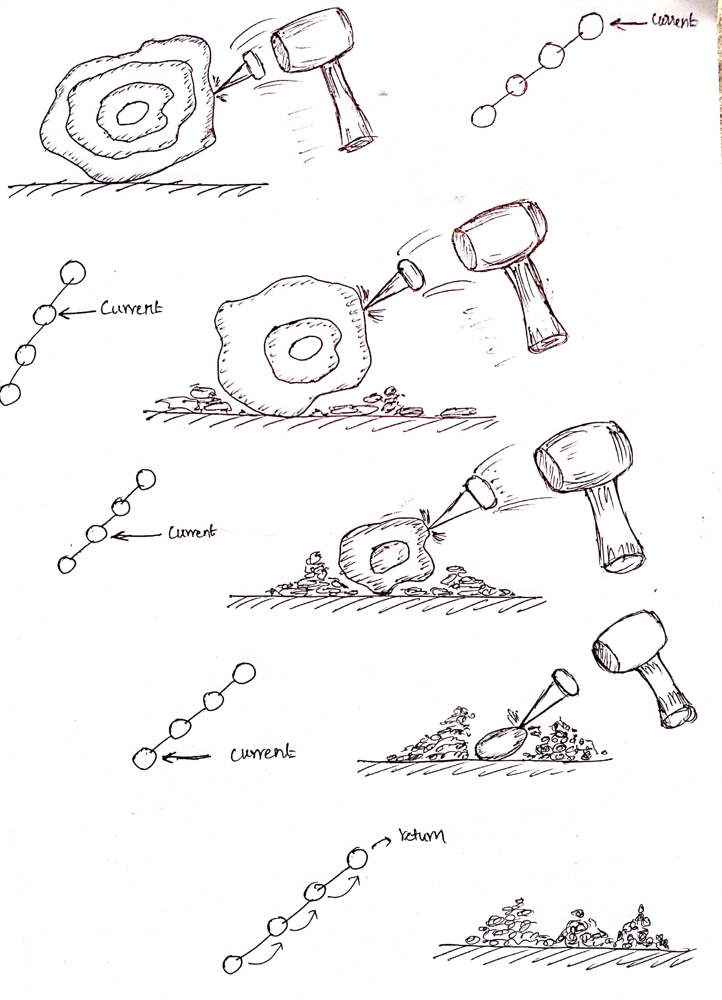
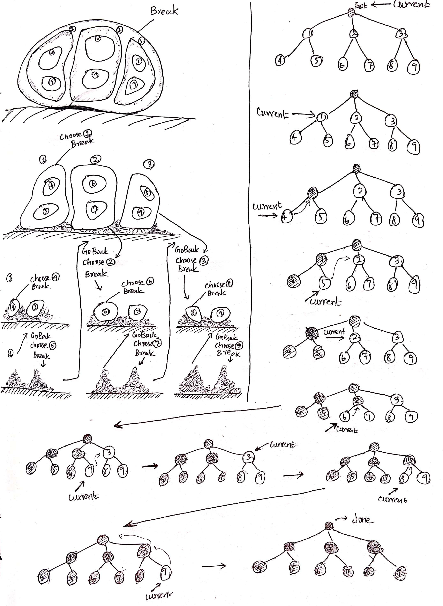

## What is Recursion?

If a function calls itself to solve a problem it can be called as *recursion*. Before diving into recursion, let's explore some basic concepts of programming which will help later.

### The Function call stack

When a function is called, the function is pushed on to memory stack, usually it's called as stack frame. This frame holds all the local variables used within that function. The stack frame of the function which is getting executed is like a live snapshot of the function. Once the function has been executed it is popped from the function call stack.

The key point to remember here is, 
- *everytime a function is called it gets a fresh copy of its __local variables__*.
- *each stack frame stores the current state of the function*

#### Example

```python
def square(x):
  squared = x * x 
  return squared
  
def square_of_sum(x, y):
  square_sum = square(x + y)
  return square_sum

square_of_sum(2,3)
```

#### Visualization

Click forward or use the slider

<iframe width="800" height="500" frameborder="0" src="http://pythontutor.com/iframe-embed.html#code=def%20square%28x%29%3A%0A%20%20squared%20%3D%20x%20*%20x%20%0A%20%20return%20squared%0A%20%20%0Adef%20square_of_sum%28x,%20y%29%3A%0A%20%20square_sum%20%3D%20square%28x%20%2B%20y%29%0A%20%20return%20square_sum%0A%0Asquare_of_sum%282,3%29&codeDivHeight=400&codeDivWidth=350&cumulative=false&curInstr=0&heapPrimitives=nevernest&origin=opt-frontend.js&py=3&rawInputLstJSON=%5B%5D&textReferences=false"> </iframe>

#### Further reading

- <a href="https://youtu.be/_8-ht2AKyH4" target="_blank" rel="nofollow noopener">Pointers and dynamic memory - stack vs heap</a>

### Pass by Value vs Pass by Reference

When a varaible is passed to a function as an argument, whether the function can modify the contents of that variable is based on how the variable is passed (i.e) by reference or by value.

In every langauge it varies a little but the basics remains the same.

- *pass by value* : When a variable is passed by value, the value is copied into a new variable inside the function as a local variable. This value exists independent of the caller's scope. In modern languages, primitive values are passed by value.

- *pass by reference* : When a variable is passed by reference, the value's address (label pointing to the value) is passed into the function. When I modify the contents of the object pointed by the label, the original object itself is modifed, since it is making use of the original variable instead of making a local copy. In modern languages usually non primitive variables are passed by reference.

#### Further reading

- [pass by value vs pass by reference in javascript](pass-by-value-and-pass-by-reference-in-java-script)
- <a href="https://robertheaton.com/2014/02/09/pythons-pass-by-object-reference-as-explained-by-philip-k-dick/" target="_blank" rel="nofollow noopener">pass by value vs pass by reference in python</a>
- <a href="https://robertheaton.com/2014/07/22/is-ruby-pass-by-reference-or-pass-by-value/" target="_blank" rel="nofollow noopener">pass by value vs pass by reference in ruby</a>

## Understanding Recursion

If we slice a recursive function it will always do these 3 steps in some form.

1. *Base Case* - check when to stop or not do any work at all.
2. *Solve* - do the smallest unit of work.
3. *Recurse* - pass on the rest of work by calling the recursive function (i.e) myself.

Let's see how these steps are applied to different problems and form patterns around it.

## Pattern 1 - Vanilla Recursion

*Matryoshka Doll (nested russian doll)*
<br>
<iframe width="560" height="315" src="https://www.youtube.com/embed/-xMYvVr9fd4?rel=0" frameborder="0" allow="accelerometer; autoplay; encrypted-media; gyroscope; picture-in-picture" allowfullscreen></iframe>
<br>

If I were to formulate a problem out of the video to find out the total number of dolls. How would I approach it ?

- Is there a doll?
- Then Add count 1 and open the doll.

With the above step I have opened the top layer of the doll. I keep it aside and use the same step from above.

- Is there a doll?
- Add count 1 to total and open the doll.

I can keep on doing the same steps until I'm not able to open the doll anymore (i.e) there is no new doll to examine.

Let's try translating that to a problem and use the three basic steps I described above to solve it. I have a deeply nested array and I want to know the total number of arrays or how deep the nesting goes.

*Visualize the same in python:*

<iframe width="800" height="500" frameborder="0" src="http://pythontutor.com/iframe-embed.html#code=def%20count_lists%28my_list%29%3A%0A%20%20%20%20if%28len%28my_list%29%20%3D%3D%200%29%3A%0A%20%20%20%20%20%20%20%20return%201%0A%20%20%20%20else%3A%0A%20%20%20%20%20%20%20%20return%201%20%2B%20count_lists%28my_list%5B0%5D%29%0A%20%20%20%20%20%20%20%20%0Aprint%28count_lists%28%5B%20%5B%20%5B%20%5B%20%5B%20%5D%20%5D%20%5D%20%5D%20%5D%29%29&codeDivHeight=400&codeDivWidth=350&cumulative=true&curInstr=0&heapPrimitives=nevernest&origin=opt-frontend.js&py=3&rawInputLstJSON=%5B%5D&textReferences=false"> </iframe>

<br>

This is the base and most easiest of recursion problems like how vanilla is the base for all flavors in ice creams. Problems of this sort typically have only one layer to crack.



For example, imagine any problem as a huge block of stone. This stone varies from other stones only in the way it is recursively structured (i.e) instead of a single huge rock, it is commposed of layers of smaller rocks. What this property means to me is, breaking one layer is easier than breaking the whole rock. I could go about breaking the rock without considering this special characteristic and break the rock as a whole. Otherwise, I can make use of this layered property and make my work simpler by breaking one layer at a time. This is where recursion comes in.

To do my work I follow these simple steps:

- Is there a rock?
- Then, break the layer I see.

I can keep repeating the above process until I see no rocks to break. I can also infer the three steps I mentioned in the beginning like this.

1. No rock to break - base case
2. Break the outer layer - smallest unit of work.
3. Repeating 2 until I reach case 1 - the recursive part

### Vanilla Recursion - Generic Pseudocode

If I were to write a generic function for this pattern it would look like this.

```python
def my_recursive_function(parameters):
  if(<base_condition>):
    # stop and return output if needed
  else:
    # do one unit of work
    # call myself to do the rest of work
```
<br>

**Question to ponder** : *This works fairly well. But what if? when I break the rock, I see more than one rock. That is what the next pattern is.*

## Pattern 2 - Backtracking

### Exhaustive Exploration

Continuing from the last section, what would happen if there were more than one stone when I break the a layer?


At each layer there are multiple choices to choose from. Though it looks complicated, all one has to do is, to work on one choice at a time. Once we are done with one choice we can come back and continue with the remaining choices.

Let's walk through step by step. From the previous pattern we know that I have to do 3 things.

1. Should I stop?
2. Do one unit of work
3. Recurse



Elaborating the basic steps at each layer we get these:

1. When I break the first stone, I get 3 more stones. Pass them on to next call. (Let's label them 1, 2 and 3 for better explanation)
2. I choose the stone 1 and break it. I see two stones now. I pass them on to next call. (Let's  label them 4 and 5)
3. I choose the stone 4 and break it. I don't see anymore stones so I return to where I came from step (2).
4. I choose the stone 5 and break it. I don't see anymore stones so I return step (1).
5. I choose the stone 2 and break it. I see two new stones now. I pass them on to next call. (Let's labe them 6 and 7).
6. I choose the stone 6 and break it. I don't see anymore stones so I return to previous step (5).
7. I choose the stone 7 and break it. I don't see anymore stones so I return to previous step (1).
8. I choose the stone 3 and break it. I see two new stones now. I pass them on to the next call. (let's label them 8 and 9).
6. I choose the stone 8 and break it. I don't see anymore stones so I return to previous step (8).
7. I choose the stone 9 and break it. I don't see anymore stones so I return to previous step (1).
8. I don't see anymore stones so return.

If I were to write a pseudo code for this. It would look like this:

```python
def break_stone(stone):
  if(stone.present):
    # breaking the stone will give me a bunch of stones
    stones = stone.break
    for small_stone in stones:
      break_stone(small_stone)
  else:
    # I don't see any stones.
    return
```

### Exhaustive Search - Pseudocode

```python
def my_exhaustive_search(choices):
  if(no_more_choices_left):
    # return whatever is required
  else:
    # let's handle one choice ourselves, and the rest by recursion.
    for c in choices:
      # *C* is chosen
      # do one unit of work for the chosen choice *C*
      # explore the remaining choices that could follow C
```
<br>

If I consider the stone example, there were 10 choices. I had to go through all of the choices to finish the search. Let's go through this pattern with more examples.

#### Example 1

*Print all binary numbers of length n.*

```
Input: 
2

Output:
00
01
10
11
```

*Solution*
<iframe width="800" height="500" frameborder="0" src="http://pythontutor.com/iframe-embed.html#code=def%20print_binary%28n%29%3A%0A%20%20print_binary_helper%28n,%20%22%22%29%0A%0Adef%20print_binary_helper%28n,%20s%29%3A%0A%20%20if%28n%20%3D%3D%200%29%3A%0A%20%20%20%20print%28s%29%0A%20%20else%3A%0A%20%20%20%20%23%20there%20are%20two%20choices%20here%3A%0A%20%20%20%20for%20i%20in%20range%280,2%29%3A%0A%20%20%20%20%20%20print_binary_helper%28n%20-%201,%20s%20%2B%20str%28i%29%29%0A%20%20%20%20%20%20%0Aprint_binary%282%29&codeDivHeight=400&codeDivWidth=350&cumulative=true&curInstr=0&heapPrimitives=nevernest&origin=opt-frontend.js&py=3&rawInputLstJSON=%5B%5D&textReferences=false"> </iframe>

<br>

- For this problem at every call, we have two choices to explore one for 0 and the other for 1.
- 1 - , s = "", I pick 0 from my choices and call the same function with s = "0" (inside for loop with choice, s = "1" pending)
- 2 - At second call, s = "0", I pick 0 again and call the same function with s = "00" (inside for loop with choice, s = "01" pending)
- 3 - At this point, I have already reached the base case, so print "00" and return to previous call (2)
- 4 - Reached (2) again - continue from left off point - (i.e) call myself with s = "01"
- 5 - Base condition satisfied. print "01" and return to previous call (1)
- 6 - At (1) the call continues the same recursion steps for s = "1"

If we tweak the problem statement a little we can make the same program to print all decimals of length n just by increasing the choices from (0,1) to 0-9. It's a common pattern to use helper functions to hide the extra variables in the exposed API for the user. Since we get a fresh copy of variables every time, it is also common practice to use function arguments to keep track of states between function calls.
<br>

**Question to ponder** : *In the above example, all I did was update the string "s" with different choices on each call. But, what if? I want to collect all the value into a list instead of just printing them ?*

It is fairly simple if you think about pass by value and pass by reference. I can pass in a list (by reference) and collect the result in the list instead of printing it.

```python
def print_binary(n):
  result = []
  print_binary_helper(n, "", result)
  return result

def print_binary_helper(n, s, result):
  if(n == 0):
    result.append(s)
  else:
    # there are two choices here:
    for i in range(0,2):
      print_binary_helper(n - 1, s + str(i), result)

bins = print_binary(3)
```

This code works but what if I want to represent the binary numbers as an array instead of a string. For example my result for n=2 should look like this [[0, 0], [0,1], [1, 0], [1, 1]]. This seems very similar to the previous example. Like the result set I can pass in another empty list instead of string.

```python
def get_binary_nums(n):
  result = []
  get_binary_helper(n, [], result)
  return result

def get_binary_helper(n, bin, result):
  if(n == 0):
    # will be wrong output.
    result.append(bin)
  else:
    # there are two choices here:
    for i in range(0,2):
      # I have to make choice here to add to bin
      bin.append(i)
      get_binary_helper(n - 1, bin, result)
      # since bin is a list and a reference variable
      # I have to just remove before adding the old choice before adding next choice
      bin.pop()

bins = get_binary_nums(3)
```

Strangely though, my output is *bins = [[], [], [], [], [], [], [], []]*. This strange behavior is because we are using a reference variable. Since we are passing around the same reference back and forth between function calls, we see the end state of *bin* which is empty list. To over come this we need to make a copy of the bin before pushing it to the result, so that its not pionting to the same.

<iframe width="800" height="500" frameborder="0" src="http://pythontutor.com/iframe-embed.html#code=def%20get_binary_nums%28n%29%3A%0A%20%20result%20%3D%20%5B%5D%0A%20%20helper%28n,%20%5B%5D,%20result%29%0A%20%20return%20result%0A%0Adef%20helper%28n,%20bin,%20result%29%3A%0A%20%20if%28n%20%3D%3D%200%29%3A%0A%20%20%20%20result.append%28bin%29%0A%20%20else%3A%0A%20%20%20%20for%20i%20in%20range%280,2%29%3A%0A%20%20%20%20%20%20bin.append%28i%29%0A%20%20%20%20%20%20helper%28n%20-%201,%20bin,%20result%29%0A%20%20%20%20%20%20bin.pop%28%29%0A%0Abins%20%3D%20get_binary_nums%283%29&codeDivHeight=400&codeDivWidth=350&cumulative=false&curInstr=47&heapPrimitives=nevernest&origin=opt-frontend.js&py=3&rawInputLstJSON=%5B%5D&textReferences=false"> </iframe>

*correct version*:

```python
def get_binary_nums(n):
  result = []
  get_binary_helper(n, [], result)
  return result

def get_binary_helper(n, bin, result):
  if(n == 0):
    # make a copy of the current state of bin before collecting it in result
    result.append(list(bin))
  else:
    # there are two choices here:
    for i in range(0,2):
      # I have to make choice here to add to bin
      bin.append(i)
      get_binary_helper(n - 1, bin, result)
      # since bin is a list and a reference variable
      # I have to just remove before adding the old choice before adding next choice
      bin.pop()

bins = get_binary_nums(3)
```

So far we have looked at examples which explored all available paths but it is usually the case where one is trying to find something by exploring the paths. After finding such a path, the function returns instead of exploring all the paths.

Imagine there is exactly one diamond hidden in one of those stone layers. whenever we find a diamond we can return and skip the other available paths.

### The Backtracking pattern - Generic Pseudocode

This is the pattern we tried at the end of exhaustive search pattern. Problems dealing with multiple choices at each level like permutations, combinations can be solved by using backtracking.

```python
def my_exhaustive_search(choices):
  if(no_more_choices_left):
    # return whatever is required
  else:
    # let's handle one choice ourselves, and the rest by recursion.
    for c in choices:
      if(should_i_continue_to_explore_the_path):
        # chose *C* is chosen
        # do one unit of work for the chosen choice *C*
        # Un Choose *C*
```

### Backtracking and Recursive DataStructures

<figure>
  
  <figcaption>_Credits : Mre [<a href="https://creativecommons.org/licenses/by-sa/3.0" target="_blank" rel="nofollow noopener">CC BY-SA 3.0</a>], <a href="https://commons.wikimedia.org/wiki/File:Depth-First-Search.gif" target="_blank" rel="nofollow noopener">via Wikimedia Commons</a>_</figcaption>
</figure>

Backtracking is a very generic approach that applies recursion effectively for all kinds of problems which deals with exploring many choices or paths.

Consider the stone example from earlier. Assume that each layer is a level and each smaller stones with in the bigger outerlayer are the children of outer stone. If we follow this structure, it will naturally form a tree. All backtracking problems if we draw choices at each level will form a tree.

To traverse or solve problems involving dataStructures like trees and graphs with a number of children (choices) at each level, we can naturally use backtracking. 

Backtracking, in essence works like this, it goes all the way till it reaches the end or leaf nodes and it goes back to the last call, and continues the same process with remaining choices i.e nodes. When backtracking is applied to explore different paths with in graphs and trees, it can be called as *Depth First Search*.

## Pattern 3 - Divide and Conquer

This is just another way to look at things. So far I've only talked about exploring different paths at each step when solving a problem. What I've left out in previous examples are these:

1. After doing one unit of work at each level, the call goes down deeper till all the paths are fully explored. When the call has reached the end and it comes back to the previous save point (the place where the function was called) and continues with the other choices. So far, in the problems we explored, I have been passing along the work done at each level to the next level. when I reach the end I assumed that I have solved the sub problem and exited or collected the result into a list. This approach of solving the problem as I go down is called Top Down Approach.

2. Alternatively, What I could have

I can make use of the work done at that level to do something. Recursion patterns we explored so far dealt with just breaking down a bigger problem into smaller problem while doing one unit of work at each level and go through other remaining paths.

The catch here is, becuase of call stack, the work done at each level is saved.

In this pattern though, after solving all the sub-problems they must be combined to form the solution for the bigger problem. They follow these simple steps in some form.

```
1. Divide: Break the given problem into subproblems of same type.
2. Conquer: Recursively solve these subproblems
3. Combine: Appropriately combine the answers
```

## Pattern 4 : Memoization and Dynamic Programming

This is the trickiest of all patterns we have seen so far. The general patterns for recursion applies here as well (i.e)
- there are different paths to explore
- dividing the bigger problem into smaller sub problems of the same type
- solving the sub problems recursively
- combining the solutions if required like the previous pattern

But what sets apart this from previous patterns are the following two characteristics
1. Optimal Sub strcuture property
2. Overlapping

Sometimes in recursion, there might be cases where an already explored path is revisited. To avoid the duplicate computation, we can store the result into a collection and use it instead. This technique called *memoization*. Generally when the sub-problems in path gets repeated, memoization can be applied. This property is called *overlapping subproblems*. The hardest part with this pattern finding out what to store so that it can be used later. This particular technique for solving problems in
