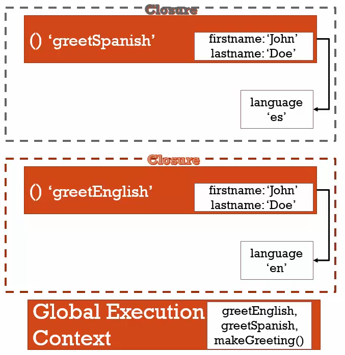

## statement and expression

- Statement is a piece of code that does something. All code blocks are statements.

- Expression is a piece of code i.e a statement that evaluates to a value. All expressions are statements. But not all statements are expressions.

> A function is both a statement and an expression.

### function statement

```javascript
function pokeDex() {
    console.log("Initializing the dex...");
}
```

- This does not return anything.
- Only placed in memory as a named function.
- Does not do anything unless executed.

### function expression

```javascript
var pokeDex = function() {
    console.log("Initializing the dex...");
}
```

- an anonymous function (not named) object is returned as value.
- the value is assigned to a variable.
- function behaves as an expression here.
- it can also be passed in function calls like any other object.


## _this_ keyword

- _this_ is set when the execution gets created
- its reference changes depending on lexical and execution context
- at global level it is pointing to window object.
- inside a function defined as an expression for a prop in object, it points to the object itself.
- inside a nested function definition inside objects, it points to global object window, this is considered a bug by many. To mitigate, a pattern relying scope chain is used by setting a variable `self = this` at top level.

```javascript
var data = {
    value: "value 1,
    update: function () {
        let self = this;
        console.log(`previous value: ${this.value}`)
        function update() {
            self.value = 'value set in nested function';
            console.log(`updated value: ${self.value}`)
        }
        update();
    }
}
data.update();
```

## automatic ; insertion and empty space

- in places like return, js engine automatically inserts ; terminating the line if there is white space. Always make sure to use () or don't end in white space.
- Apart from return statements, white space doesn't matter in JS.

```javascript
var
    a,
    // comment
    b,

    c;
```

## IIFE's (Immediately Invokable Function Expression)

- directly invoking a function during definition.

```javascript
// valid expression
var value = function (){
    var library;
    // init library
    return library;
}()
```

- when you try the same without assignment, JS engine will throw error

```javascript
function () {
    var library;
    // init library
    return library;
}()
```

- Above function will Uncaught SyntaxError: Function statements require a function name
- After adding a name you will get Uncaught SyntaxError: Unexpected token ')'
- To make this work, you have to add ()
```javascript
(function (){
    var library;
    // library
    return library;
})(argument1, argument2, ...)
```

- This pattern is commonly used by libraries to isolate namespace and code.

## Closure

- JS engine makes sure that a variable inside a function can always access it based on its lexical context/ scope chain, irrelevant of whether the execution context is active or not currently.

```javascript
function makeAdder(x) {
  return function (y) {
    return x + y;
  };
}

const add5 = makeAdder(5);
console.log(add5(100))
```

- in this example, every time makeAdder is called, it creates variable x and returns a function that's accessing x and the execution context of makeAdder is popped off. However when add5(100) is called, add5 is still able to access x which was initialized to 5.

### factory pattern using closure

```javascript
function makeGreeting(language) { 
    return function(firstname, lastname) {

        if (language === 'en') {
            console.log('Hello ' + firstname + ' ' + lastname);   
        }

        if (language === 'es') {
            console.log('Hola ' + firstname + ' ' + lastname);   
        }
        
    }
    
}

var greetEnglish = makeGreeting('en');
var greetSpanish = makeGreeting('es');

greetEnglish('John', 'Doe');
greetSpanish('John', 'Doe');
```




## Callbacks

- when a function is passed as an argument to another function to be executed inside, it is referred to as callback.
- it's a commonly used pattern.


## call, apply & bind

- bind - creates a copy of the function it is called on and attaches the passed object to 'this' variable.

```javascript
var person = {
    firstName: "John",
    lastName: "Doe"
}

function printName(greetVariable) {
    console.log(greetVariable + " " + this.firstName + " " + this.lastName);
}

var greetName = printName.bind(person)
helloName('Hello')
```

- call - invokes the function setting 'this' as the object passed.

```javascript
printName.call(person, 'Hola')
```

- apply - same as call, except the arguments are passed as one array instead of comma separated parameter list.

```javascript
printName.call(person, ['Hola'])
```
