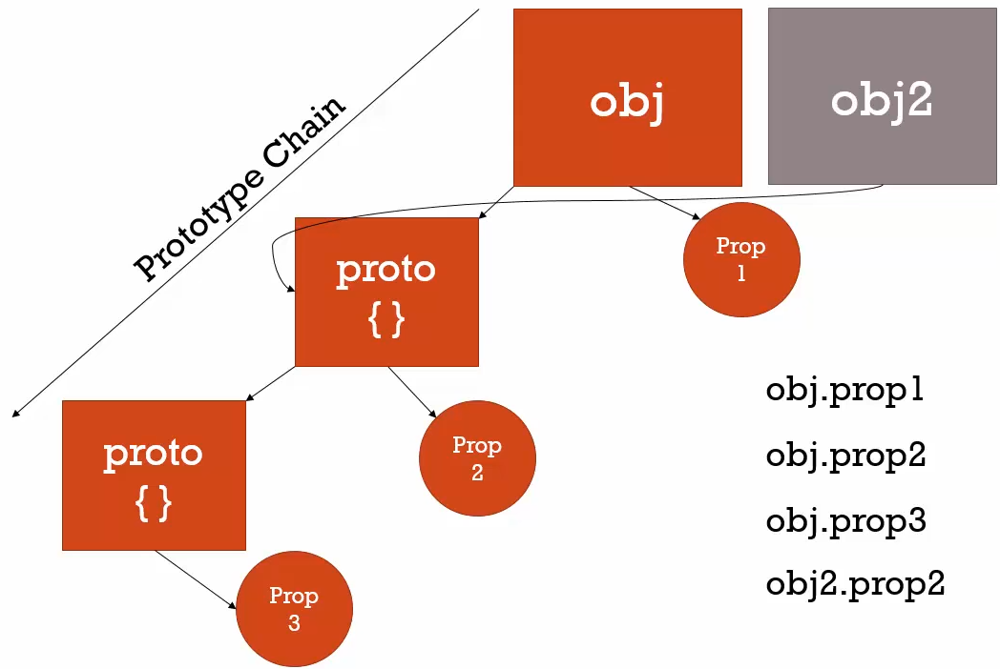

In JavaScript, inheritance = One object has access to properties and methods of another object.

## Classical Inheritance

- verbose

## Protypal Inheritance

- simple

All varibles in javascript are either an object or a primitive. Nothing else.

All objects contain an implicit property called `__proto__`. This is the base object that contains default properties and methods for any object. This property shouldn't be mutated normally.

When a property is accessed in an Object, JS engine first looks up for the property in the Object directly. If it not found, it looks up the `__proto__` object. It traveses up the path till it reaches the base object. This is called prototypal inheritance as it's based on prototype chain.


```javascript
var obj = {
    prop1: 'value at level 1'
};
var obj2 = {};
var proto_obj1 = {
    prop2: 'value 2'
};
var proto_obj2 = {
    prop3: 'value 3'
};

proto_obj1.__proto__ = proto_obj2;
obj.__proto__ = proto_obj1;
obj2.__proto __ = proto_obj1;
```
> NOTE: __proto__ should never used in practical scenarios. This is only for understanding.



## Reflection

- An Object can look at itself, listing and changing its properties and methods.
- `obj.hasOwnProperty(prop_name)` returns true/ false based on whether the given property name is present directly on the object.
- underscore library makes use of this to implement `_.extend` method that copies all properties from different objects to a target object.


## Function constructors.

- when `new` keyword is called before a function, it creates an empty object `{}` and sets `this` as reference to the new empty object. If the function is not returning anything, the newly created object is returned. Make note that constructor functions shouldn't `return` anything as it'll override the object setup using `this`. This pattern is used to initialize objects with different properties and values supplied.
- All functions contain a property called `prototype` (along with name property). `prototype` is an empty object by default. This comes into play only when the function is used as object constructor. Otherwise, it is not used. When a `new` key is used to create an object using function, the created object's __proto__ property points to the `prototype` object. This is how prototype chain is setup.
- As a pattern, common methods and properties are added to `prototype` object as it doesn't create a copy and keeps only one copy in the prototype object which is efficient. This is the proper way to setup prototype chain.
- If `new` keyword is not used, function constructor will behave like a normal function and simply return `undefined` as it's not returning anything explicitly. Convention is to start function constructors with Caps for easier debugging.

```javascript
function Person(fName, lName) {
    // this = {}
    this.firstName = fName;
    this.lastName = lName;
    // if something else is returned here, it will override this and return that.
}
// by default prototype property of a function constructor is always an empty object {}.
Person.prototype.getFullName = function () {
    return this.firstName + " " + this.lastName;
}

var person1 = new Person('Jonh', 'Doe');
var person2 = new Person('Jane', 'Doe');

// both person1 and 2's __proto__ will be pointing to Person's prototype object.
// {
//      getFullName: f(),
//      constructor: f Person
// }
```

- a function is a special Object that looks like this internally

```javascript

{
    name: '<name of the function>',
    prototype: {},//becomes usable when function is a constructor
    __proto__: 
}

```

### In built function constructors

- Boolean
- Number
- String
- Date

- Libraries use built-in constructor's prototypes to add additional functionalities. In production code, it is not recommended to use these in-built constructors as they are objects wrapping primitive value and not primitive values directly. So they cause un-intended side-effects via coercion.
- `dayjs` is a popular library that adds on functionalities for Date object.

## Pure Prototypal Inheritance - Object.create

- Another way to setup protoype chain is to use `Object.create` function. It creates an empty object and sets the `__proto__` property to the object passed similar to `new` key word.

```javascript
var personMethods = {
    getFullName: function() {
        return this.firstName + " " + this.lastName;
    }
}

var person1 = Object.create(personMethods);
person1.firstName = "John";
person1.lastName = "Doe";
person1.getFullName(); // works because person1.__proto__ = personMethods
```

- simple polyfill (code snippets adding missing functionalities) to understand Object.create

```javascript
if (!Object.create) {
  Object.create = function (o) {
    if (arguments.length > 1) {
      throw new Error('Object.create implementation'
      + ' only accepts the first parameter.');
    }
    function F() {}
    F.prototype = o;
    return new F();
  };
}
```

## class

- `class` is just a syntactic sugar for constructor function.

```javascript
//class declaration - syntactic sugar 
class Person {
    firstName; // this is not needed, added here for clarity
    lastName;  // you can use this to set default value
    version = "0.1" // means this.version = "0.1"

    constructor(fName, lName) {
        this.firstName = fName;
        this.lastName = lName
    }

    getFullName() {
        return `${this.firstName} ${this.lastName}`;
    }
    // setting up prototype chain
    // instead adding methods to each object - all functions defined are kept at prototype object
    // translates to this.prototype = { 
    //     getFullName: function() { 
    //         return `${this.firstName} ${this.lastName}`; 
    //     } 
    // }
}

//

//clasexpression
let p = class {

}
```

### extends keyword

- is used to set up prototypal inheritance chain

```javascript
class A {
    classAProtoFunction1 () {
        return "classAfunction1"
    }
}

class B extends A {
    classBProtoFunction1 () {

    }
}

const x = new B();

// this will setup prototype in this way.
/*

A.__proto__ = {} //default object
A.prototype = { classAProtoFunction1: }
// after extending
B.prototype = { classBProtoFunction1: }
B.prototype.__proto__ = A.prototype
B.__proto__ = A

so 
x.__proto__ -> B.prototype
x.__proto__.__proto__ -> A.prototype
*/
```

### static properties and methods

- by adding 'static' prefix to a property or method inside class, it is stored at the class directly and not considerd when instances are created using new.
- 'static' methods can only access other 'static' methods and properties

```javascript
class Config {
    static version = "1.0";
    
    constructor(name) {
        this.configName = name;
    }
    
    static getVersion() {
        return this.version;
    }

    // this will return undefined as `this` will be referring to the instance object created by new keyword
    static getName() {
        return this.configName;
    }

    // access static properties with class name directly
    getVersion() {
        return Config.version;
    }
}

const userSettings = new Config("User Settings");
userSettings.version // won't be avialable
Config.version // it's set directly on the class.
userSetting.getVersion();
```

### private properties and methods

- by adding `#` as prefix to property and method names, they are restricted to be accessed only with in the class structure.
- Private properties are not part of the prototypical inheritance model since they can only be accessed within the current class's body and aren't inherited by subclasses. So, private properties and methods are not added in `prototype` object.
- Only way to access them is via exposed public methods.
- Refer: https://developer.mozilla.org/en-US/docs/Web/JavaScript/Reference/Classes/Private_properties

```javascript
class ClassWithPrivate {
  #privateField = "This is a private field initialized with value";

  #privateMethod() {
    return "called privateMethod()";
  }

  //using private method and property
  publicMethod () {
    const computedValue = this.#privateMethod();
    return this.#privateField + " - " + computed;
  }

  static #privateStaticField = "private static field intialized with value";

  static #privateStaticMethod() {
    return "called private static Method";
  }

  static publicStaticMethod() {
    // from here you can access private static property and methods using class name
    return this.#privateStaticField + " - " + this.#privateStaticMethod();

  }
}

const privateObjectInstance = new classWithPrivate();
privateObjectInstance.publicMethod();

ClassWithPrivate.publicStaticMethod();
```

- instance: an object created using object creation feature of the language (in js using function constructor or class)
- field: a property
- public: directly accessible to both code written inside the object and outside the object.
